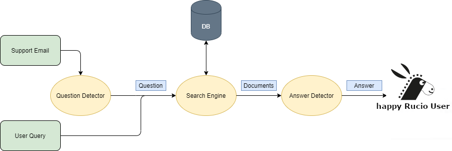
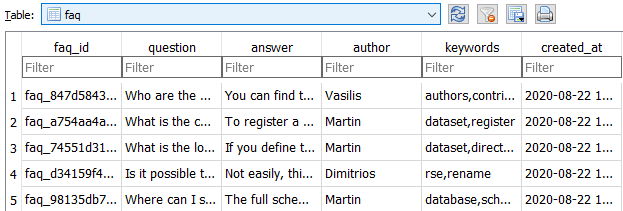

# Contents
- [Contents](#contents)
- [How are questions answered?](#how-are-questions-answered)
- [What happens in the background?](#what-happens-in-the-background)
- [How do tables in the Data Storage look?](#how-do-tables-in-the-data-storage-look)

# How are questions answered?
You can `ask_donkeybot.py` and you shall receive an answer from Donkeybot!

Flow chart for the Question-Answering pipeline.   



**1. Email as input.**  

When a new Email is received it goes through the [QuestionDetector](https://github.com/rucio/donkeybot/blob/master/lib/bot/question/detector.py#L13) and a [Question object](https://github.com/rucio/donkeybot/blob/master/lib/bot/question/base.py#L9) is created.

Originally Donkeybot was meant to  answer incoming support emails. After an initial data analysis on archived emails. We decided to expand the idea and introduce new data sources and the option to query the bot by a single input.  

Functionality for Emails as input still exists, but Donkeybot has not yet been deployed on any servers to listen for incoming emails.

See [How To Use](docs/../how_to_use.md) for information on the QuestionDetector and Question objects.

**2. User Query as input.**  
You ask a question and it is treaded as a query by the Search Engine in the next step.

This is the input the `ask_donkeybot.py` script expects.

See [How To Use](./docs/../how_to_use.md) on how to query Donkeybot.

**3. Search Engine.**  

Once a Question has been detected from a new Email or given by a user query, the Search Engine looks into Donkeybot's Data Storage and retrieves most similar Documents from our multiple data sources.

Documents are :  
- Archived questions, from emails or GitHub issues. 
- Rucio documentation pages, from GitHub.   
- FAQ question-answer pairs, created by Rucio experts.  

SearchEngine subclasses exists for each data source.
- [SearchEngine](https://github.com/rucio/donkeybot/blob/master/lib/bot/searcher/base.py#L13) for general documentation 
- [QuestionSearchEngine](https://github.com/rucio/donkeybot/blob/master/lib/bot/searcher/question.py#L9) for Questions 
- [FAQSearchEngine](https://github.com/rucio/donkeybot/blob/master/lib/bot/searcher/faq.py#L9) for FAQs 

See the searcher module [Source Code](https://github.com/rucio/donkeybot/tree/master/lib/bot/searcher) for each Search Engine.

See [How To Use](./docs/../how_to_use.md) to learn how to create and index each different Search Engine. 

**4. Answer Detector.**  
Once the most relevant Documents have been retrieved we use them as context for the new Question in a SQuAD like manner to generate answers with a given confidence.

Current implementation caches and uses DistilBERT and BERT-large cased/uncased models, fine-tuned on the [SQuAD dataset](https://rajpurkar.github.io/SQuAD-explorer/) which provides us with good baseline performance.

See [Future Improvements](../docs/faq_gsoc.md) for how performance can be improved.  

See [How To Use](./docs/../how_to_use.md) to see the [AnswerDetector](https://github.com/rucio/donkeybot/blob/master/lib/bot/answer/detector.py#L22) in action.

<!> *sidenote*:  
 For SQuAD based transformer models to work they expect an input 
``` json 
{ 
    "question": "How does a SQuAD based model detect answers?",
    "context": "Given a passage of text (context), we can ask  questions about the passage that can be answered by referencing short excerpts from the text."} 
```
Donkeybot's answer to the above will look something like this : 
``` json
{ 
    "score": "0.567..",
    "start": 99,
    "end": 139,
    "answer": "referencing short excerpts from the text."
}

```
# What happens in the background?

To setup Donkeybot for use we need to run `build_donkeybot.py` script.
Let's take a look at everything that it does get Donkeybot up and running.

**1. Fetching raw data from all sources.**   

First step in `build_donkeybot.py` is to fetch all  raw data used as our knowledge base. This is done with the help of the fetcher module. See the [Source Code](https://github.com/rucio/donkeybot/tree/master/lib/bot/fetcher) for more detail.

Data sources include :   
- Rucio Support Emails : These aren't fetched  automatically, rather they are provided by CERN/Rucio and are anonymized through hashing. Thus, keeping all user private information secured. See [How To Use](./docs/../how_to_use.md) for information on how you can also hash private information.
- Rucio GitHub issues : Another data source we use are the public [Rucio GitHub issues](https://github.com/rucio/rucio/issues). Which are fetched with the use of the [GitHub Issues API](https://docs.github.com/en/rest/reference/issues).
- Rucio Documentation : From [Rucio Documentation](https://github.com/rucio/rucio/tree/master/doc/source) GitHub pages. Also, fetched by using the [GitHub API](https://docs.github.com/en/rest). Current implementation missing pages from the [Rucio Rest API documentation](https://github.com/rucio/rucio/tree/master/doc/source/restapi) since we would have to compile Sphinx with the makefile and that was not done for the prototype.
- Rucio FAQs : A small sample of some FAQs can be found in the [faq.json](https://github.com/rucio/donkeybot/blob/master/data/faq.json) file, these are inserted into the `faq` table of the Data Storage.

Subclasses for each fetcher exist and a factory method is used to construct them.
- [IssueFetcher](https://github.com/rucio/donkeybot/blob/master/lib/bot/fetcher/issues.py#L22)
- [RucioDocsFetcher](https://github.com/rucio/donkeybot/blob/master/lib/bot/fetcher/docs.py#L17)

See [How To Use](docs/../how_to_use.md) for source code examples of the above and how to use the GitHub IssueFetcher,  for your own project!

**2. Parsing and storing raw data.**   

After fetching the raw data from all our sources, the second step in `build_donkeybot.py` is done with the parser module. It processes the data and performs any transformations we need.   
For example, all dates which come from a number of countries and local timezones, Rucio users reside in, need to follow the same format. Raw email data also require a lot of post processing and cleaning to be ready for use.   
See `emails` table under [How do tables in the Data Storage look?](#how-do-tables-in-the-data-storage-look)
and [Problems Faced](docs/../faq_gsoc.md) for more info.


Following the same logic with the rest of our code base, subclasses for each parser exist and a factory method is used to construct them.
- [EmailParser](https://github.com/rucio/donkeybot/blob/master/lib/bot/parser/emails.py#L70)
- [RucioDocsParser](https://github.com/rucio/donkeybot/blob/master/lib/bot/parser/docs.py#L22)
- [IssueParser](https://github.com/rucio/donkeybot/blob/master/lib/bot/parser/issues.py#L28)
- [IssueCommentParser](https://github.com/rucio/donkeybot/blob/master/lib/bot/parser/comments.py#L23)

The [Source Code](https://github.com/rucio/donkeybot/tree/master/lib/bot/parser) or [How To Use](docs/../how_to_use.md) for more detail on what each parser does.

See [How do tables in the Data Storage look?](#how-do-tables-in-the-data-storage-look) for more detail on information saved for each data source.

**3. Detecting previously asked Questions.**   

To have a proper knowledge base for Donkeybot as a Question Answering system and utilize our data sources correctly we need to :

1) Detect questions that users have asked in the past.
2) Archive them, along with useful information, to the Data Storage for future use.

This is the third step in `build_donkeybot.py` and is done with the help of the [QuestionDetector](https://github.com/rucio/donkeybot/blob/master/lib/bot/question/detector.py#L13).

Questions detected are categorized and exist in:
- [Rucio email Questions](https://github.com/rucio/donkeybot/blob/master/lib/bot/question/emails.py#L6)
  - Context : Bodies of the reply emails to the email where the question was detected.
- [GitHub issue Questions](https://github.com/rucio/donkeybot/blob/master/lib/bot/question/issues.py#L6)
  - Context : The comments under a GitHub issue where the question was detected.
- [GitHub comment Questions](https://github.com/rucio/donkeybot/blob/master/lib/bot/question/comments.py#L6)  
  - Context : The comments after the comment in the issue where the question was detected. 

Each of these detected questions is archived to the Data Storage under the same 'questions' table.

See [How do tables in the Data Storage look?](#how-do-tables-in-the-data-storage-look) for more detail on the information archived for each Question.

**4. Indexing data for the Search Engines**  
As mentioned in [How are questions answered?](#how-are-questions-answered) the job of the search engines for each new user query is to find :
* Most similar archived Question 
* Most similar Rucio documentation
* Most similar FAQ

For [Okapi BM25](https://en.wikipedia.org/wiki/Okapi_BM25) to work, the information retrieval algorithm we use, and not miss any documents, we have to create a document-term matrix 
for each of our data sources. This process is called indexing. 

The fourth step of `build_donkeybot.py` is to create these document-term matrixes, to index our data.


A search engine exists for each data source we need to retrieve : 
- [SearchEngine](https://github.com/rucio/donkeybot/blob/master/lib/bot/searcher/base.py#L13) for general documentation  
- [QuestionSearchEngine](https://github.com/rucio/donkeybot/blob/master/lib/bot/searcher/question.py#L9) for Questions   
- [FAQSearchEngine](https://github.com/rucio/donkeybot/blob/master/lib/bot/searcher/faq.py#L9) for FAQs   

Each search engine also has their own `.create_index()` and `.load_index()` methods. The first is used in `build_donkeybot.py` and when new data is added (eg. when adding new FAQs). The second is used when `ask_donkeybot.py` is run.

Currently for the needs of the GSoC project and for fast prototyping [SQLite](https://www.sqlite.org/index.html) was used as our data storage so we had to hard code the Search Engines and the methods used for indexing.    
In the future the project can be expanded to use [Elasticsearch](https://www.elastic.co/home) as our Data Storage. This has the advantages of automatically creating an index from our data, also using BM25 as the default information retrieval algorithm and providing more advanced search engine capabilities.

See [Future Improvements](/docs/faq_gsoc.md) for more ideas for expansion.

**5. Downloading and caching transformer models.**   
The final step in `build_donkeybot.py`  is to download and cache any [transformer models](https://huggingface.co/models?filter=question-answering) we want to use.

Current [Hugginface's  transformers](https://github.com/huggingface/transformers) models that are cached include:
- [distilbert-base-cased-distilled-squad](https://huggingface.co/distilbert-base-cased-distilled-squad)
- [distilbert-base-uncased-distilled-squad](https://huggingface.co/distilbert-base-uncased-distilled-squad)
- [bert-large-uncased-whole-word-masking-finetuned-squad](https://huggingface.co/bert-large-uncased-whole-word-masking-finetuned-squad)
- [bert-large-cased-whole-word-masking-finetuned-squad](https://huggingface.co/bert-large-cased-whole-word-masking-finetuned-squad)

Donkeybot can work with any pretrained language model from this list:  
https://huggingface.co/models?filter=question-answering   
*very*  small code changes are needed under the `build_donkeybot.py` script to do this.

# How do tables in the Data Storage look?

Once you run `build_donkeybot.py`, `data_storage.db` will be created under the data/ folder of your cloned repository.  

Let's take a look at the information is stored in each of the tables under our Data Storage.

- `questions` table   
   
    - **_ids** : 
      - **email_id** : when the archived question's origin is an email
      - **issue_id** : when the archived question's origin is a GitHub issue
      - **comment_id** : along with issue_id when the origin is a comment under a GitHub issue.
    - **context** : This is what is used by the AnswerDetection along with the user query to try and detect a new answer. To understand the context of each question see "**Detecting previously asked Questions**" under [What happens in the background?](#what-happens-in-the-background) to understand the 

- `answers` table for [Answer objects](https://github.com/rucio/donkeybot/blob/master/lib/bot/answer/base.py#L8) from [AnswerDetector](https://github.com/rucio/donkeybot/blob/master/lib/bot/answer/detector.py#L22).   
    
  * **metadata** : json holding metadata from the origin of where the answer was detected from. (eg. Link of original documentation or most similar question)
  * **confidence** : NULL when answer is detected in FAQ since BERT confidence and BM25 score are not comparable.
  * **label** : Can be used for supervision and dataset creation. See [Future Improvements](/docs/faq_gsoc.md) for more info. 

- `emails` table for Email objects from [EmailParser](https://github.com/rucio/donkeybot/blob/master/lib/bot/parser/emails.py#L70).
   
  - **clean_body** : When an email is a reply then its body will also hold the *quoted*  bodies of past emails from the same reply chain (conversation). `clean_body` is the result of cleaning up reply emails and only keeping the body of the newest email. To achieve this several regex patterns where used, since each user had his own email client. See [regex patterns used](https://github.com/rucio/donkeybot/blob/master/lib/bot/config.py#L12).
  - **conversation_id** : The IMAP client used for the raw fetched emails did not chain replies together. The [EmailParser](ttps://github.com/rucio/donkeybot/blob/master/lib/bot/parser/emails.py#L70) creates a `conversation_id` based on the subject of the emails. Thus, generating the reply chains (conversations) which are needed to give context to the questions detected in a conversation.
 

- `faq` table holding FAQs from [faq.json](https://github.com/rucio/donkeybot/blob/master/data/faq.json) file or any FAQs added with the gui.

    - **keywords** : Used by the [FAQSearchEngine](https://github.com/rucio/donkeybot/blob/master/lib/bot/searcher/faq.py#L9) to better match FAQs with new user queries.


The rest of the tables include : 
- `docs` table
- `issues` table 
- `issue_comments` table  
    
    Which don't hold any complicated information.

And the search engine indexes :
- `faq_doc_term_matrix` table
- `questions_doc_term_matrix` table
- `rucio_doc_term_matrix` table  
  
    Which simply hold the document_ids and terms for use by the search engines.